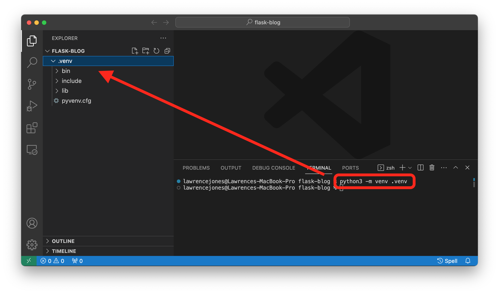
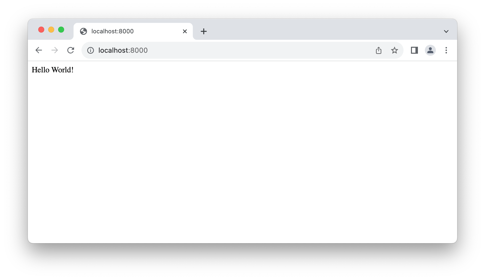

# Python/Flask Website

*Dependencies: pip and venv*

## Setup Project Folder

1. Create a folder on desktop named `flask-blog`
2. Open Visual Studio code and drag `flask-blog` into the app window.

## Virtual Environment
1. open terminal in Visual Studio Code. Confirm you are in the `flask-blog` directory: `user@computername flask-blog` set up the virtual environment:
	1. Mac: `python3 -m venv .venv`
	2. Windows: `py -3 -m venv .venv`

	
2. Activate the environment:
   1. Mac: `. .venv/bin/activate`
   2. Widnows: `.venv\Scripts\activate`

   Shell prompt will change to show the name of the activated environment:
   
   ```
   (.venv) lawrencejones@Lawrences-MacBook-Pro flask-blog %
   ```
   
## Install Flask

> Also includes Frozen-Flask and Flask-FlatPages so we can create a static site.

```
pip install Flask Frozen-Flask Flask-FlatPages
```
## 

## Server.py

create a file in the `flask-blog directory` named `server.py` and copy this code into it:

```python
import sys, os
from flask import Flask
app = Flask(__name__)# URL Routing — Home Page

@app.route("/")
def index():
 return “Hello World!”

# Main Function, Runs at http://0.0.0.0:8000
if __name__ == "__main__":
 app.run(port=8000)
```

You can now run the `server.py` file and you will have a functioning website at localhost:8000

```
 * Serving Flask app 'server'
 * Debug mode: off
WARNING: This is a development server. Do not use it in a production deployment. Use a production WSGI server instead.
 * Running on http://127.0.0.1:8000
Press CTRL+C to quit
127.0.0.1 - - [30/Oct/2023 08:51:02] "GET / HTTP/1.1" 200 -
127.0.0.1 - - [30/Oct/2023 08:51:02] "GET /favicon.ico HTTP/1.1" 404 -

```

>**hint:** *localhost is the same as 127.0.0.1 and is easier to type*

Open a browser and go to localhost:8000 to see the live server:

